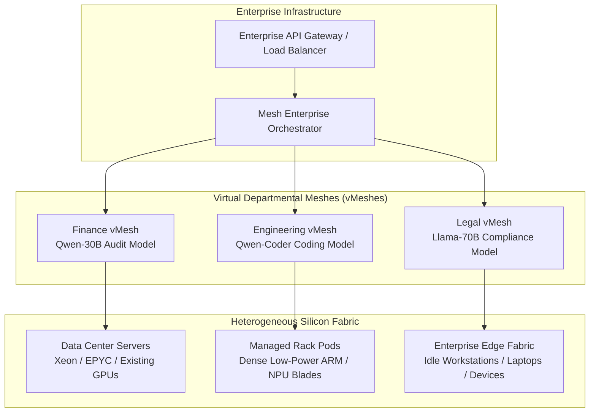

# Enterprise Scaling, Multi-Model Architecture & Security Strategy

This document details how the Mesh architecture scales from local/developer setups to large-scale enterprise deployments, solves the multi-model serving problem, and enforces defense-in-depth cybersecurity.

---

## 1. Enterprise Scaling Strategy (The Pitch Narrative)

### The Enterprise Pain Point
Large enterprises (financial services, defense, healthcare, telecom) face two simultaneous pressures:
1. **Compliance & Sovereignty Mandates:** 40% of enterprise leaders want on-premises or sovereign hosting due to data privacy laws (EU AI Act, India DPDP Act 2023, HIPAA). Sending proprietary IP or customer data to public multi-tenant APIs (OpenAI, Anthropic) is legally or contractually barred.
2. **Capital Waste & GPU Lead Times:** Purchasing dedicated H100/Blackwell clusters requires 9–18 month procurement cycles and massive capital expenditures ($300k+ per node). Once installed, data center utilization averages only 20–41% (59% compute waste documented on national clusters).

### Scaling from Edge to Enterprise: The 4 Pillars

#### 1. Hierarchical Pod Topology (Racks to Pods to Clusters)
* Instead of individual unmanaged phones, enterprise deployments utilize **1U/2U Pod Enclosures** housing high-density, low-power ARM/NPU blades (or clustered enterprise workstations).
* Each Pod operates an embedded Host controller with ultra-low latency internal interconnects (PCIe / USB 3.2 Gen 2 / 10GbE).
* Clusters scale horizontally by adding pods behind an enterprise load-balancing orchestrator.

#### 2. Virtual Meshes (vMeshes) & Dynamic Departmental Re-provisioning
* Analogous to VMware virtualizing server hardware, MeshAI creates **vMeshes** dedicated to business units:
  * **Daytime:** Workstations and pods partition into high-throughput Developer & Analyst vMeshes.
  * **Overnight:** Unused corporate machines dynamically re-allocate via Ned Capsules into batch-processing audit meshes, eliminating off-peak waste.

#### 3. Heterogeneous Silicon Federation
* Enterprises do not discard existing silicon. MeshAI federates across heterogeneous hardware:
  * Enterprise servers run embeddings, output heads, and orchestrate.
  * Accelerated consumer GPUs (RTX 3090/4090) and NPU blades run heavy intermediate layers.
  * The Planner / Fitter uses measured micro-benchmarks to place layers proportionally to silicon capability.

#### 4. Auditability & Compliance Governance
* Every inference pass is logged with its cryptographic **Capsule ID** and quality evidence hash.
* Full traceability guarantees that inputs, activations, and outputs never crossed external networks, providing proof for regulatory audits.

---

## 2. Solving the Multiple Models Problem

### Why Simple Switching Fails
In distributed split inference, changing base models requires re-allocating memory across all nodes (**70–87s** delay). Multiplexing distinct base models on a single mesh causes thrashing.

### The 3-Tier Multi-Model Engine
1. **Dedicated Always-Warm Residency Pods:**
   * Holding model memory at rest on low-power devices costs only **$0.168/GB-month** (~14× cheaper than an RTX 3090, ~37× cheaper than cloud spot).
   * Pods are dedicated to primary enterprise base models (e.g. Pod 1 holds Qwen3-30B, Pod 2 holds Llama-3-70B), permanently hot and ready for zero-latency execution.
2. **Sub-100ms Task LoRA Hot-Swapping:**
   * Using llama.cpp's dynamic adapter swapping (`--lora-init-without-apply`, `llama_set_adapters_lora`), a single base model resident across nodes serves diverse departmental tasks by swapping lightweight LoRAs in **<100ms**.
3. **Frugal Cascade Routing:**
   * Incoming queries pass through a lightweight router:
     * Routine tasks run on standalone edge models (0.6B / 1.7B / 4B).
     * Only queries requiring complex reasoning or multi-step agent actions escalate to the distributed 30B/70B mesh.

---

## 3. Defense-in-Depth Cybersecurity

### 1. Architectural Air-Gap: Host-Pinned Embeddings
* The first and last layers (`token_embd`, `output`, `output_norm`) are strictly pinned to the enterprise host.
* **Result:** Raw prompt text, user tokens, and vocabulary logits **never leave the host controller**. Helper devices receive only high-dimension hidden activations.

### 2. Physical Custody Model
* Deployments operate strictly within enterprise custody (on-premise or managed private hosting).
* Sidesteps the vulnerabilities of decentralized P2P networks (Sybil capacity spoofing, Byzantine malicious nodes, and activation inversion attacks).

### 3. Mutual-Auth Wire Tunneling
* Internal cluster traffic runs over private subnets or TLS-terminated relay sockets (`relay.py`), authenticated by single-use session tokens verified with constant-time equality checks (`Wire.same()`).

### 4. Non-ECC Memory Canary Tests
* Mobile and consumer LPDDR memory lacks hardware ECC.
* The system executes periodic deterministic canary runs (15-problem gate with fixed seeds) during idle cycles to identify and quarantine failing memory chips before data corruption can occur.
