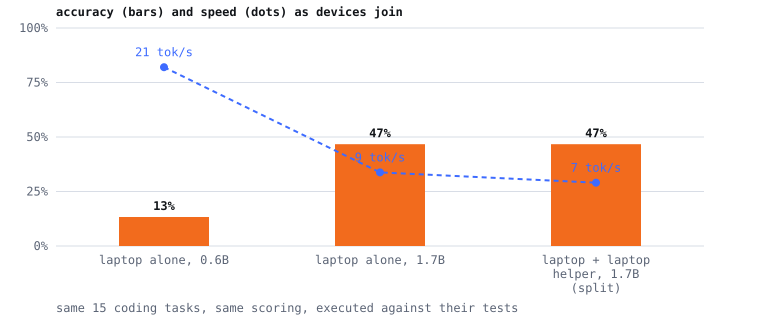

# What each configuration is worth

The same 15 coding problems, asked of every setup, scored by running the
answers against their tests. No partial credit, no human judgement.

| setup | accuracy | passed | median speed | median per task | total | measured |
|---|---|---|---|---|---|---|
| laptop + 2 phones, 30B | **100.0%** | 15/15 | 6.8 tok/s | 20.7 s | 300.9 s | 2026-09-27 09:04 |
| laptop alone, 0.6B | **13.3%** | 2/15 | 20.9 tok/s | 5.3 s | 89.5 s | 2026-09-27 03:45 |
| laptop alone, 1.7B | **46.7%** | 7/15 | 8.6 tok/s | 13.8 s | 216.0 s | 2026-09-27 03:43 |
| laptop + laptop helper, 1.7B (split) | **46.7%** | 7/15 | 7.4 tok/s | 14.3 s | 251.0 s | 2026-09-27 03:36 |

## Failures

**laptop + 2 phones, 30B** failed 0: none

**laptop alone, 0.6B** failed 13: running_max (IndexError: list index out of range), balanced_brackets (SyntaxError: unterminated string literal (detected at line 3)), word_frequencies (AssertionError), roman_to_int (AssertionError), flatten_nested (TypeError: 'int' object is not iterable), group_anagrams (AssertionError), parse_duration (ValueError: invalid literal for int() with base 10: '1h30'), matrix_spiral (AssertionError), longest_common_prefix (AssertionError), csv_column_sum (TypeError: string indices must be integers, not 'str'), retry_backoff (AssertionError), semver_compare (AssertionError), chunk_text (AssertionError)

**laptop alone, 1.7B** failed 8: word_frequencies (AssertionError), merge_intervals (AssertionError), roman_to_int (AssertionError), group_anagrams (AssertionError), parse_duration (ValueError: Invalid unit: 1), matrix_spiral (AssertionError), csv_column_sum (ValueError: could not convert string to float: 'x'), chunk_text (AssertionError)

**laptop + laptop helper, 1.7B (split)** failed 8: word_frequencies (AssertionError), merge_intervals (AssertionError), roman_to_int (AssertionError), group_anagrams (AssertionError), parse_duration (ValueError: Invalid unit: 1), matrix_spiral (AssertionError), csv_column_sum (ValueError: could not convert string to float: 'x'), chunk_text (AssertionError)
